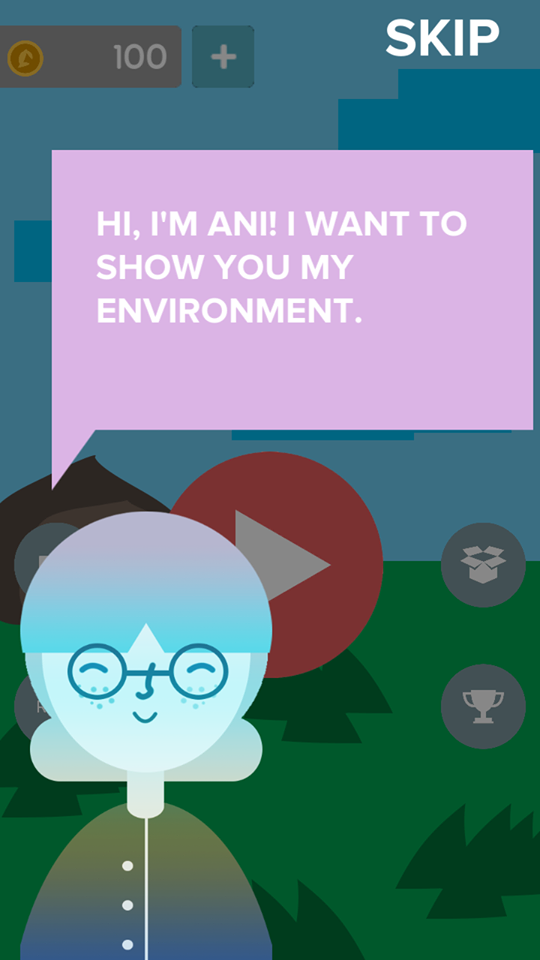
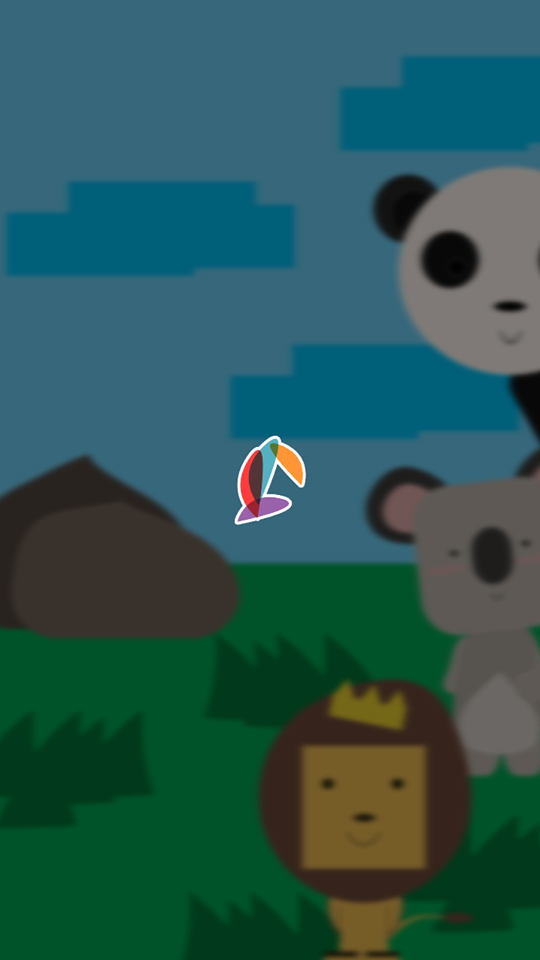
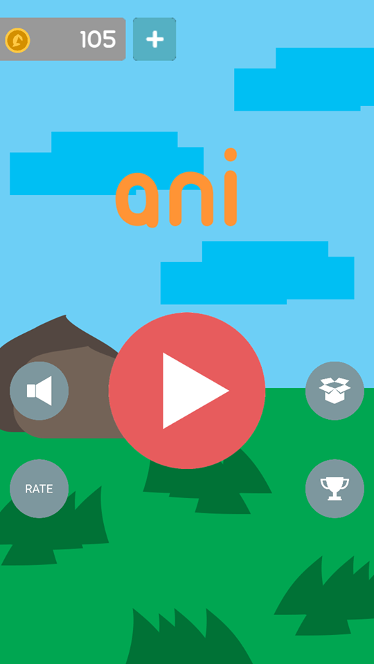

# Ani
Ani short for Animal Index, an AR E-Learning for ages 6-11 years old which focuses on animals. This project is created using Unity and runs on Android Devices version 4.1 and up. This project uses [Unity Android Microsoft Vision Api Demo](https://github.com/timokranz/Unity-Android-Microsoft-Vision-Api-Demo) which is one of the repositories in this account(timokranz).

{:height="250px"}
 {:height="250px"}
 {:height="250px"}
 {:height="250px"}

# License
By cloning this Repository you agree that before you use this project you will have to email one of the developers for permission to use it personally or for educational purposes. Using this project for commercial will grant the contributors to earn a part of the money earned by those who are using this project. You are not to distribute this project without the permission of the contributors, anyone who refuses to follow this shall be reported immediately to the authorities.

# Note
This project is still in progress and would probably be finished by March 2018. Contributions to this project will not be accepted until the Minimum Viable Product is delivered as well as Issues posted about this repository.

# Contributors:
- [Andrew M. Oplas](https://www.facebook.com/andrew.oplas)
- [Ma.Trisha E. Tagadiad](https://www.facebook.com/trshtgdds)
- [Maria Himaya Rabago](https://www.facebook.com/itwasfeb)
- [Timothy O. Ouano](https://www.facebook.com/TrashTalkTim)
